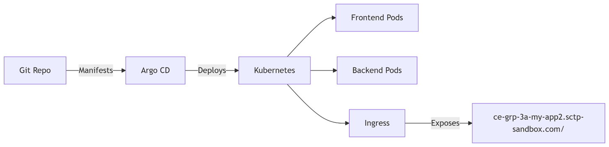

# my-app2 Kubernetes Deployment

This repository contains the Kubernetes manifests and ArgoCD configuration required to deploy my-app2, a web application consisting of a frontend and a backend fraud detection service, into a Kubernetes cluster. Deployment is managed via ArgoCD for GitOps-based continuous delivery.

The eks cluster used is ce-grp-3a-uat-eks-cluster 
It is created by uat branch of https://github.com/joseph03/sctp-cap-eks

---

# 🚀 Architecture

## Frontend

Static web app served by frontend-service on port 80

Backed by a deployment using image:
dkjt/frontend-static-7766:v1.0.10

The frontend web page is defined [here](https://github.com/joseph03/sctp-cap-webpage?tab=readme-ov-file)

## Backend

Fraud detection microservice (fraud-detection)

Exposed internally on port 4000

Deployed with 2 replicas for high availability

The backend service is defined [here](https://github.com/joseph03/sctp-cap-fraud)

## Ingress

### NGINX Ingress resource routes external HTTP(S) traffic:

/api/detect → backend (fraud-detection)

/ (all other paths) → frontend

### Host:
ce-grp-3a-my-app2.sctp-sandbox.com

## Namespace

All resources are deployed in ns-app

## Monitoring

Backend annotated for Prometheus scraping (/health endpoint)

## 📁 Key Files
| File                   | Purpose                                                                 |
|------------------------|-------------------------------------------------------------------------|
| `ingress.yaml`         | External access + path routing (`/api/detect` → backend, `/` → frontend)|
| `service.yaml`         | Frontend service (port 80 → container 3000)                            |
| `backend-service.yaml` | Backend service (port 4000)                                            |
| `deployment.yaml`      | Frontend pod specs (image, resources, ports)                           |
| `backend-deploy.yaml`  | Backend deployment (replicas, rolling updates, probes)                 |
| `app2.yaml`            | ArgoCD app definition for automated sync                               |

---

# 🔄 Deployment Workflow
GitOps with ArgoCD
All manifests are stored in this repo. Changes are auto-synced to the cluster by ArgoCD.

Ingress Routing
NGINX Ingress exposes the app at ce-grp-3a-my-app2.sctp-sandbox.com with custom backend timeouts.

Service Discovery
Internal services use Kubernetes label selectors for connection between frontend and backend.

# 🛠️ How to Use
Clone this repository and adjust configs as needed.

Ensure ArgoCD is installed and configured in your cluster.

Apply the app2.yaml manifest to ArgoCD to begin automated deployment.

Access the application via the [configured Ingress host.](https://ce-grp-3a-my-app2.sctp-sandbox.com/)

## Notes on image version
Remember to update frontend (sctp-cap-webpage) and backend (sctp-cap-fraud) image version everytime there is an update to the image.

update frontend image version at deployment.yaml
update backend image version at backend-deploy.yaml

# 📝 Notes
Backend uses rolling updates for zero downtime.

Resource requests/limits are set for efficient usage.

Health and readiness probes are configured for robust monitoring and traffic management.